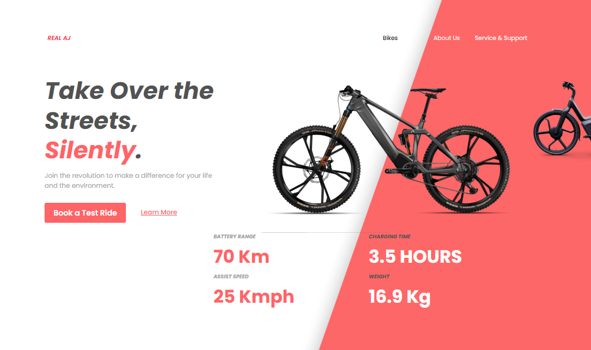

# Landing Page com Tailwind CSS

## Projeto:

Este projeto tem como finalidade criar um site utilizando o framework Tailwind CSS, convertendo um layout desenvolvido no Figma em um projeto em HTML. A atividade faz parte da avaliação final do 1º bimestre da disciplina de Linguagem de Marcação, oferecida pelo SENAI Jandira.

## Funcionalidades

- Layout responsivo (Desktop, Tablet e Mobile)
- Estrutura HTML semântica
- Estilização com Tailwind CSS
- Seções organizadas: Header, Conteúdo Principal, e Footer
- Ícones e links de navegação no cabeçalho

## Web-Site

O site foi desenvolvido no formato de Landing Page, com foco principal em sua alta responsividade, permitindo que se adapte de forma eficiente a diferentes dispositivos, como desktops, tablets e celulares. A página apresenta um anúncio de uma Bicicleta online, que apresenta:

- Um cabeçalho contendo a logomarca da empresa, links de navegação e ícones.
- Uma foto da Bicicleta principal, junto a uma menor no canto, além de um Background de cor chamativa.
- Uma frase como um título, um pequeno textinho, além de dois botões, um como chamada de ação e outro para mais informações
- Por último, um header contendo algumas informações tecnicas sobre o produto em si.

Link para meu Design no [Figma](https://www.figma.com/design/ZtAItZsWGttRA0oys3yHZh/Lima-Atividade-bike--Copy-?node-id=0-1&p=f&t=9X608BXWT2IuIYSe-0).

## Tecnologias
- HTML
- Tailwind CSS
- Figma

## Autora
- Aluna: [Geovanna Silva](https://www.linkedin.com/in/geovanna-sousa-28289234a?utm_source=share&utm_campaign=share_via&utm_content=profile&utm_medium=android_app)
- Instituição: SENAI Jandira
- Curso Desenvolvimento de Sistemas

